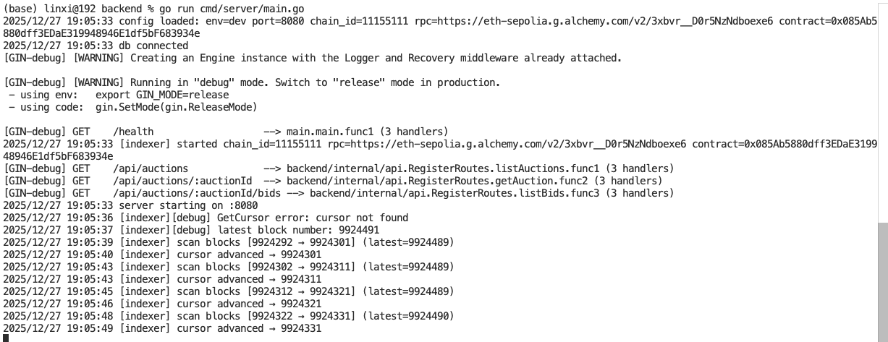
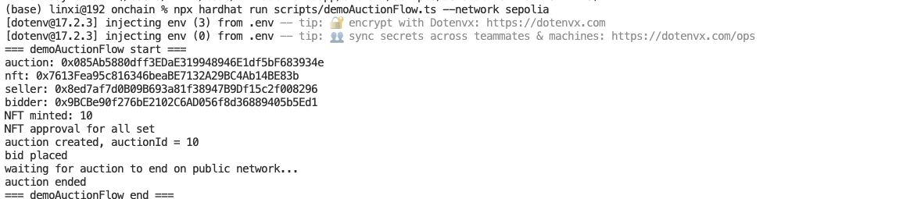
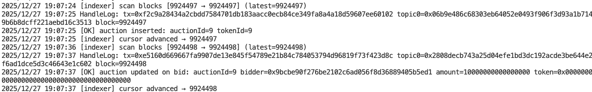
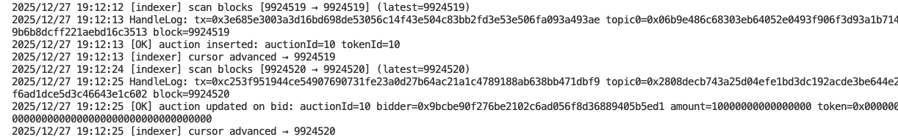
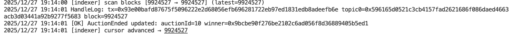
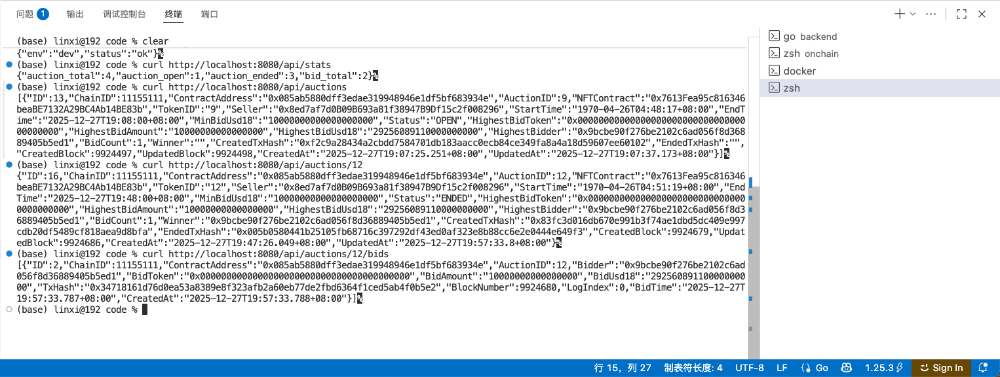
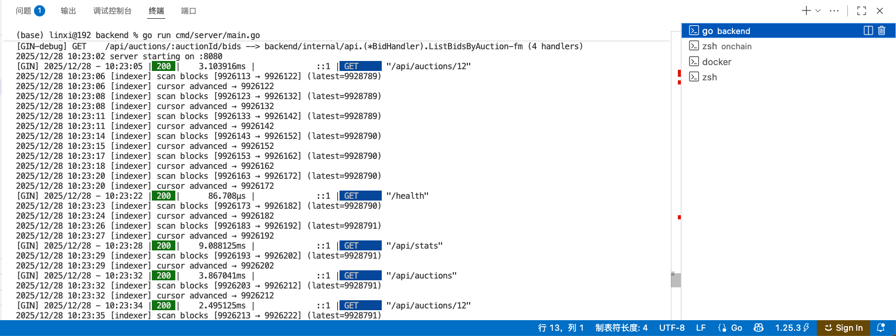

# NFT Auction Indexer & API Backend

这是一个基于以太坊测试网（Sepolia）的 NFT 拍卖后端项目，核心目标是：

1）实时订阅并解析链上 NFT 拍卖合约事件  
2）将拍卖、出价等链上行为结构化存储到数据库  
3）对外提供稳定、可直接被前端调用的 REST API  
4）实现“链上数据 → 后端索引 → 前端可用接口”的完整闭环  

————————————————————  
项目核心功能说明  
————————————————————  

一、链上事件索引（Indexer）

Indexer 持续扫描区块链，并订阅 NFT 拍卖合约的事件，包括：

- AuctionCreated：创建拍卖
- BidPlaced：出价
- AuctionEnded：拍卖结束
- AuctionCancelled：拍卖取消

每一个事件都会被解析，并写入 MySQL 数据库中，主要涉及：

- auctions 表：拍卖主信息、状态、最高出价、赢家等
- bids 表：每一笔出价的完整历史记录
- sync_cursors 表：索引进度游标，保证可恢复、可重启

Indexer 启动后会自动追赶最新区块，并持续运行。

二、后端 API（供前端使用）

后端通过 Gin 提供 REST API，前端无需关心链上细节，只需要调用接口即可。

当前已经实现并测试通过的接口包括：

- GET /health  
  健康检查接口

- GET /api/stats  
  获取平台统计数据：
  - 拍卖总数
  - 进行中的拍卖数
  - 已结束拍卖数
  - 出价总数

- GET /api/auctions  
  获取所有拍卖列表（默认包含进行中与已结束）

- GET /api/auctions/:auctionId  
  获取某一个拍卖的完整详情，包括：
  - NFT 信息
  - 拍卖状态
  - 最高出价
  - 出价次数
  - 获胜者（若已结束）

- GET /api/auctions/:auctionId/bids  
  获取某个拍卖的全部出价历史（按时间排序）

所有接口均已通过 curl 在本地验证。

————————————————————  
技术栈说明  
————————————————————  

- Go  
- Gin（HTTP API 框架）
- GORM（ORM）
- MySQL（数据存储）
- go-ethereum（解析链上事件）
- Hardhat（测试链上拍卖流程）
- Alchemy（Sepolia RPC）

————————————————————  
项目结构简述  
————————————————————  

cmd/server/main.go  
- 程序入口
- 同时启动 Indexer 和 API Server

internal/indexer  
- 链上索引逻辑
- 事件解析与数据库写入

internal/infra/db  
- 数据表模型
- Repo 层（Auction / Bid / Stats 等）

internal/api  
- HTTP Handler
- 路由注册
- 中间件（注入 chain_id / contract）

internal/config  
- 环境变量与配置加载

————————————————————  
成果展示（Screenshots）  
————————————————————  

1）Indexer 正常扫描区块并处理事件  

2）Hardhat 测试脚本完整跑通拍卖流程  

3）链上创建拍卖事件被成功索引  

4）链上出价事件被成功索引  

5）拍卖结束事件被成功索引

6）API 查询测试成功 

curl http://localhost:8080/health 

curl http://localhost:8080/api/stats  

curl http://localhost:8080/api/auctions

curl http://localhost:8080/api/auctions/12 

curl http://localhost:8080/api/auctions/12/bids

7）API 查询后端日志

